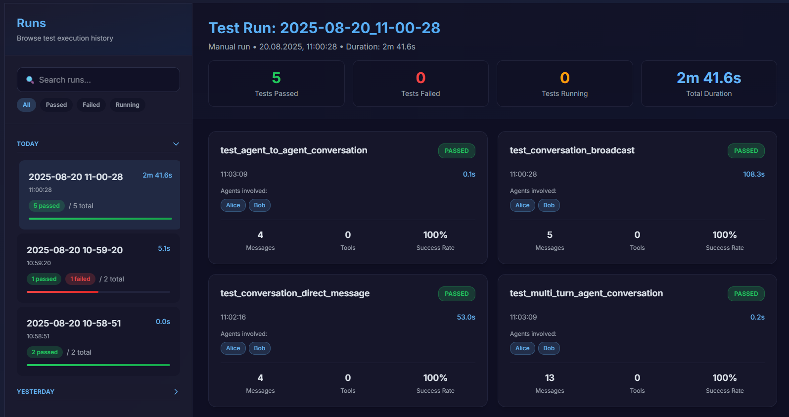
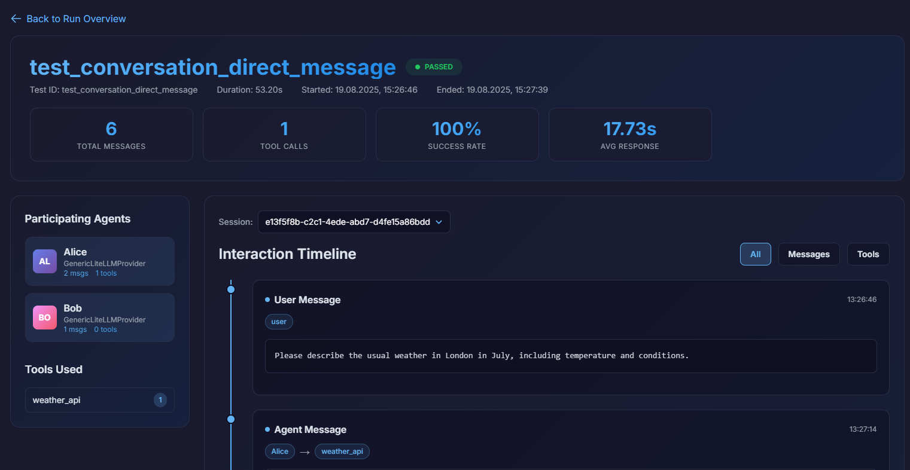
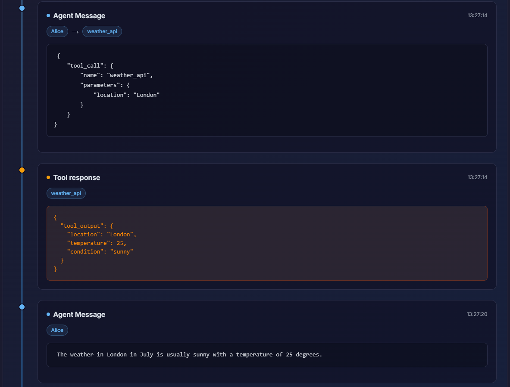

<h1 align="center">
  Maia
</h1>
<h2 align="center">
  Multi-AI Agents Test Framework
</h2>



**Maia Test Framework** is a `pytest`-based framework designed for testing multi-agent AI systems. It offers a flexible and extensible platform to create, run, and analyze complex multi-agent simulations.

## Key Features

- **Multi-Agent Simulation**: Simulate conversations and interactions between multiple AI agents.
- **Extensible Provider Model**: Easily integrate with various AI model providers
- **Built-in Assertions**: A suite of assertions to verify agent behavior, including content analysis and participation checks.
- **Orchestration policies**: Decide how messages shall be routed.
- **Judge agent**: Specialized agent for judging if result of a test is proper or not
- **Tool Integration**: Agents can use external tools to perform actions.

## Integrations

Maia supports a variety of AI frameworks and libraries which opens possibility to use any model you want. Here are some of the built-in integrations:

| Integration | Provider |
| :--- | :--- |
| [**LiteLLM**](https://github.com/BerriAI/litellm) | [`LiteLLMBaseProvider`](framework/src/maia_test_framework/providers/litellm_base.py) |
| [**LangChain**](https://github.com/langchain-ai/langchain) | [`LangChainProvider`](framework/src/maia_test_framework/providers/langchain.py) |
| [**CrewAI**](https://github.com/crewAIInc/crewAI) | [`CrewAIProvider`](framework/src/maia_test_framework/providers/crewai.py) |

It's easy to create your own provider by extending `BaseProvider`.

## Installation

Install the framework using `pip`:

```bash
pip install maia-test-framework
```

## Getting Started

### 1. Define Your Agents

Create a test class that inherits from `MaiaTest` and define your agents in the `setup_agents` method.

```python
from maia_test_framework.testing.base import MaiaTest
from maia_test_framework.providers.generic_lite_llm import GenericLiteLLMProvider

class TestMyAgent(MaiaTest):
    def setup_agents(self):
        # Using a pre-configured provider
        self.create_agent(
            name="coder",
            provider=self.get_provider("ollama"),
            system_message="You are a helpful coding assistant."
        )

        # Using a provider defined on the fly
        self.create_agent(
            name="reviewer",
            provider=GenericLiteLLMProvider(config={
                "model": "ollama/mistral",
                "api_base": "http://localhost:11434"
            }),
            system_message="You are a helpful code reviewer."
        )
```

### 2. Create a Conversation Session

Use the `create_session` method to start a conversation with one or more agents.

```python
import pytest

@pytest.mark.asyncio
async def test_code_generation(self):
    session = self.create_session(["coder", "reviewer"])
    # ...
```

### 3. Simulate a Conversation

Use the `Session` object to simulate user and agent interactions.

```python
@pytest.mark.asyncio
async def test_code_generation(self):
    session = self.create_session(["coder"])
    await session.user_says("Write a Python function that returns the factorial of a number.")
    response = await session.agent_responds("coder")
    assert "def factorial" in response.content
```

### 4. Use Assertions

The framework includes powerful assertions to validate agent behavior.

#### Content Assertions

Check the content of agent messages for specific patterns.

```python
from maia_test_framework.testing.assertions.content_patterns import assert_professional_tone

@pytest.mark.asyncio
async def test_professionalism(self):
    session = self.create_session(["coder"], assertions=[assert_professional_tone])
    await session.user_says("Write a Python function and add a joke to the comments.")
    with pytest.raises(AssertionError):
        await session.agent_responds("coder")
```

#### Participation Assertions

Ensure that agents are participating in the conversation as expected.

```python
from maia_test_framework.testing.assertions.agents_participation import assert_agent_participated

@pytest.mark.asyncio
async def test_agent_participation(self):
    session = self.create_session(["coder", "reviewer"])
    await session.user_says("Write a Python function and have it reviewed.")
    await session.agent_responds("coder")
    await session.agent_responds("reviewer")
    assert_agent_participated(session, "coder")
    assert_agent_participated(session, "reviewer")
```

#### Judge agent

Create specialized agent to judge if result is ok or not.

```python
import pytest
from maia_test_framework.core.judge_agent import JudgeAgent
from maia_test_framework.testing.base import MaiaTest

def setup_agents(self):
    self.create_agent(
        name="RecipeBot",
        provider=self.get_provider("ollama"),
        system_message="You are a helpful assistant that provides recipes.",
    )

@pytest.mark.asyncio
async def test_judge_successful_conversation(self):
    """Tests that the JudgeAgent correctly identifies a successful conversation."""
    judge_agent = JudgeAgent(self.get_provider("ollama"))
    session = self.create_session(["RecipeBot"], judge_agent=judge_agent)

    await session.user_says("Can you give me a simple recipe for pancakes?")
    await session.agent_responds("RecipeBot")
```

## Running Tests

Run your tests using `pytest`:

```bash
pytest
```

## Test Dashboard

The project includes a Next.js-based dashboard to visualize test reports.

### Dashboard Features
- **Test Run Overview**: See a list of all test runs, including statistics like pass/fail rates and total duration.
- **Detailed Test View**: Drill down into individual tests to see detailed information, including participants, messages, and assertions.
- **Interaction Timeline**: Visualize the conversation flow between agents and tools in a timeline view.

### Screenshots

**Runs View:**


**Test View:**



### How to Use

1.  **Generate Test Reports**: Run your `pytest` tests as usual. The framework will automatically generate JSON report files in the `test_reports/` directory.

2.  **Run the Dashboard**:
    1. Using Git clone  

    ```bash
    git clone https://github.com/radoslaw-sz/maia.git
    cd dashboard
    yarn install
    yarn dev
    ```
    2. Using CLI
    ```bash
    npx @maiaframework/create-maia-dashboard my-dashboard
    cd my-dashboard
    yarn dev
    ```

3.  **View the Reports**: Open your browser to `http://localhost:3000` to see the dashboard. It will automatically read the generated JSON files from the `test_reports` directory. You can configure a different directory by setting the `TEST_REPORTS_DIR` environment variable before running the dashboard.

## Contributing

Contributions are welcome! Please open an issue or submit a pull request on GitHub.

## License

This project is licensed under the Apache License 2.0. See the `LICENSE` file for details.
